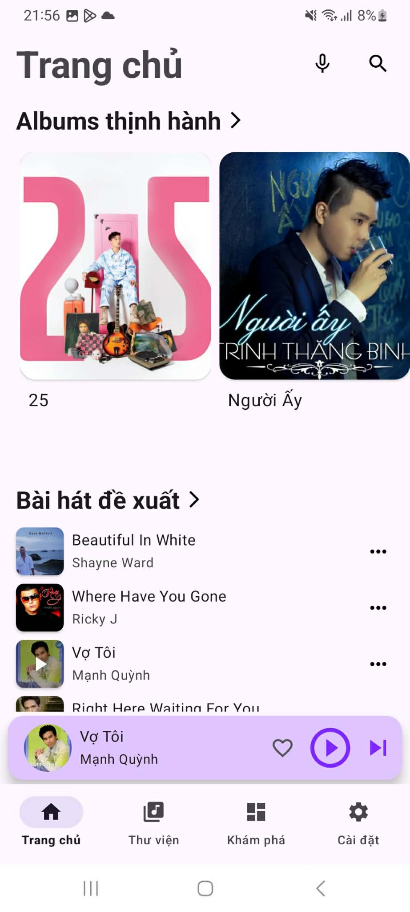
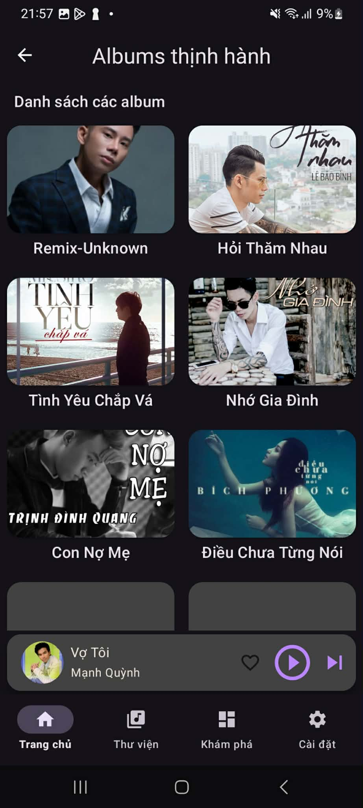
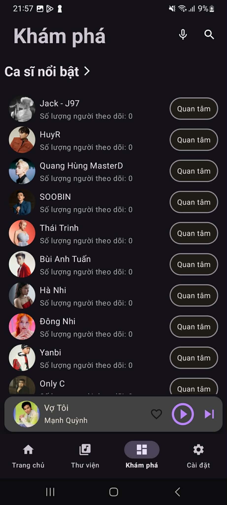
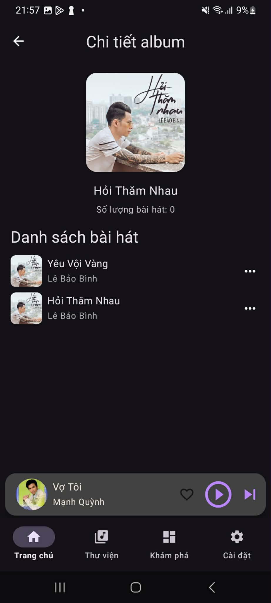
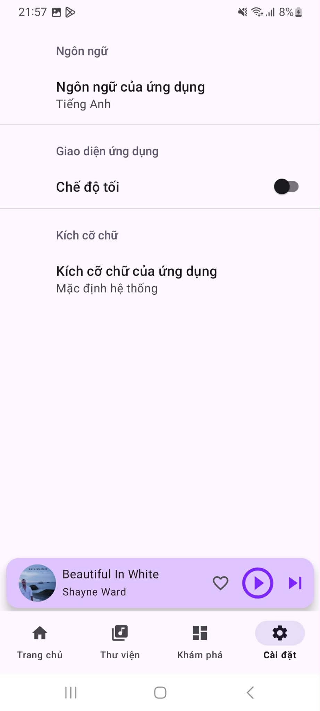
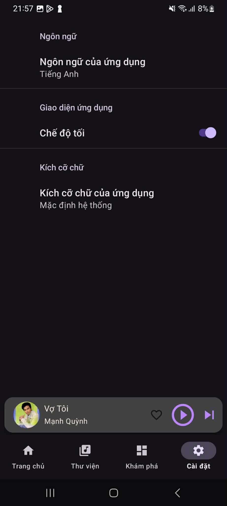

# Ứng dụng nghe nhạc tương tự zingmp3

Ứng dụng nghe nhạc trên Android, được xây dựng theo kiến trúc đa module. Ứng dụng hỗ trợ phát nhạc, khám phá bài hát, tìm kiếm, quản lý playlist cá nhân và tùy chỉnh giao diện để nâng cao trải nghiệm người dùng.

#Chức năng

## Chức năng chính

### 1. Phát nhạc
- Phát nhạc trực tuyến
- Hiển thị **Mini Player** và màn hình **Now Playing**
- Điều khiển phát nhạc: phát/tạm dừng, chuyển bài, tua bài
- Hiển thị tiến trình phát nhạc
- Hỗ trợ phát nhạc nền bằng **Foreground Service**
- Hiển thị thông báo điều khiển khi đang phát nhạc

### 2. Khám phá nội dung
- Trang **Home** hiển thị bài hát đề xuất và album nổi bật
- Trang **Discovery** hỗ trợ khám phá:
    - Nghệ sĩ nổi bật
    - Bài hát phổ biến
    - Danh sách gợi ý cho người dùng

### 3. Tìm kiếm
- Tìm kiếm bài hát theo tên
- Tìm kiếm theo nghệ sĩ
- Hỗ trợ tìm kiếm bằng giọng nói
- Lưu lịch sử tìm kiếm gần đây

### 4. Quản lý thư viện cá nhân
- Lưu bài hát yêu thích
- Xem danh sách bài hát đã nghe gần đây
- Tạo playlist mới
- Đổi tên playlist
- Xóa playlist
- Thêm bài hát vào playlist
- Xem chi tiết playlist

### 5. Thao tác với bài hát
- Thêm vào danh sách yêu thích
- Thêm vào playlist
- Thêm vào hàng chờ phát
- Xem thông tin album
- Xem thông tin nghệ sĩ
- Tải xuống bài hát
- Báo lỗi nội dung

### 6. Tùy chỉnh giao diện
- Hỗ trợ **Dark Mode**
- Thay đổi ngôn ngữ ứng dụng
- Tùy chỉnh cỡ chữ hiển thị

## Mục tiêu ứng dụng
Được phát triển nhằm mang đến trải nghiệm nghe nhạc thuận tiện, trực quan và dễ sử dụng. Ứng dụng tập trung vào khả năng khám phá nội dung, quản lý thư viện cá nhân và tối ưu trải nghiệm phát nhạc trên thiết bị Android.

